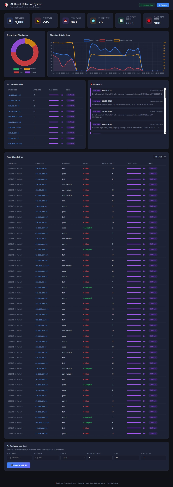
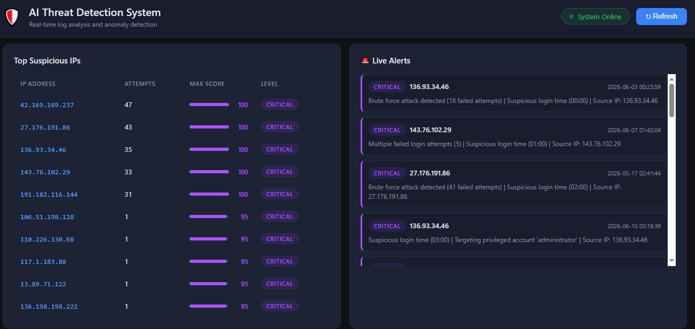
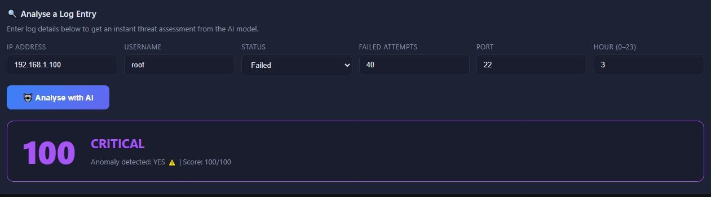
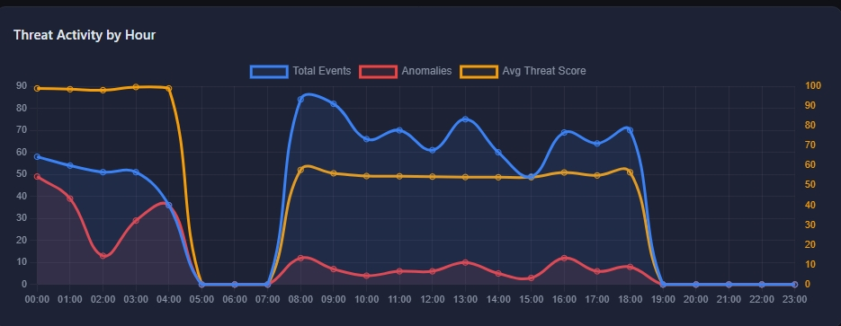

# 🛡️ AI-Powered Threat Detection & Log Analysis System


A full-stack cybersecurity application that uses machine learning to analyse system authentication logs, detect anomalies, assign threat scores, and display real-time security alerts on an interactive dashboard.

---

## 🌐 Live Demo

**Live API:** https://threat-detection-system-g6nm.onrender.com

**To view the dashboard locally:**
1. Clone this repository
2. Follow the setup steps below
3. Serve the frontend folder with a local server (do NOT double-click the
   HTML file directly — see Step 8 below for why)

---

## 🎯 What This Project Does

This project works like a mini Security Operations Center (SOC). It reads system login logs, uses a machine learning model to find suspicious patterns, gives each event a threat score from 0 to 100, and displays everything on a live dashboard with charts and alerts.

**Real threats it can detect:**
- Brute force attacks (many failed login attempts from one IP)
- Off-hours logins (suspicious activity at 2am, 3am)
- Privileged account targeting (attacks on root and admin)
- Unusual IP activity (IPs appearing hundreds of times)
- SSH port scanning and exploitation attempts

---

## 📸 Screenshots

**Dashboard Overview**


**Live Alerts**


**Real-Time Threat Analysis**


**Threat Timeline**



## 📸 Project Features

| Feature | Description |
|---|---|
| Log Parsing | Reads Linux auth.log and CSV log files |
| Anomaly Detection | Isolation Forest ML model trained on 1000 log entries |
| Threat Scoring | Every event scored 0 to 100 |
| Severity Levels | LOW, MEDIUM, HIGH, CRITICAL |
| REST API | 8 endpoints serving all dashboard data |
| Interactive Dashboard | Charts, alerts table, IP analysis, live threat feed |
| Real-time Analysis | Analyse any log entry instantly using the form |
| Automated Tests | 13 pytest tests covering all endpoints |

---

## 🛠️ Tech Stack

| Layer | Technology | Why I Chose It |
|---|---|---|
| Backend | Python + Flask | Python has the best ML library support. Flask is lightweight and easy to learn |
| Machine Learning | Scikit-learn Isolation Forest | Detects anomalies without needing labelled training data |
| Database | SQLite | Zero setup required, single file, perfect for portfolios |
| Frontend | HTML + CSS + JavaScript | No framework needed, keeps it simple and fast |
| Charts | Chart.js | Interactive, lightweight, loads from CDN |
| Deployment | Render | Free cloud hosting with GitHub integration |

---

## 🧠 How the Machine Learning Works

The core of this project is an **Isolation Forest** model. Here is exactly how it works step by step:
Step 1 — Raw Log File

↓

Step 2 — Log Parser

Extracts: IP address, timestamp, username, login status, port number

↓

Step 3 — Feature Engineering

Converts everything into 10 numerical features the model can understand

↓

Step 4 — Isolation Forest Model

Trained on 1000 log entries (750 normal, 250 suspicious)

Learns what normal activity looks like

Flags anything that looks different as an anomaly

↓

Step 5 — Threat Scorer

Converts raw ML output into a 0 to 100 human-readable score

Adds bonus points for dangerous behaviours

↓

Step 6 — Alert Generator

Creates alerts for any event scoring above 50

↓

Step 7 — Dashboard

Displays charts, tables, and live alerts

**The 10 Features Used by the Model:**

| Feature | What It Captures |
|---|---|
| failed_attempts | Number of failed login attempts |
| hour | What hour the login happened (0 to 23) |
| is_night_hour | 1 if login happened between midnight and 5am |
| is_root_attempt | 1 if the target account was root or admin |
| ip_attempt_count | How many times this IP appeared in the logs |
| status_numeric | 1 if login failed, 0 if accepted |
| port | Port number used for the connection |
| is_ssh_port | 1 if port 22 was used (standard SSH attack port) |
| fail_rate | Failed attempts divided by total IP appearances |
| combo_score | How many red flags are true at the same time |

**Why Isolation Forest?**
Unlike other ML algorithms, Isolation Forest does not need labelled data. You do not need to tell it which logs are attacks and which are normal. It learns normal patterns on its own and flags anything unusual. This makes it perfect for real-world cybersecurity where you rarely have perfectly labelled attack data.

**Measured Performance**

Since the synthetic data generator labels every entry as normal or
suspicious, I used that label purely for evaluation (never for training,
since Isolation Forest is unsupervised). Measured on the generated dataset:

- Precision: 0.87 (87% of flagged alerts are real attacks)
- Recall: 1.00 (100% of real attacks get caught)
- F1 score: 0.93
- False positive rate: 4.9%

**Known limitation:** the model's contamination parameter is set to 0.25,
matching this generator's known attack ratio. In a real deployment you
would not know this number in advance, so this number is a controlled
benchmark, not a claim about real-world accuracy. The scoring is a 50/50
blend of the ML model's anomaly signal and rule-based heuristics
(failed-attempt thresholds, off-hours logins, root targeting), and the
API exposes both components separately so an analyst can see why
something was flagged, not just that it was.
---

## 🔬 External Validation

To check whether this approach generalizes beyond synthetic data, I ran
the same Isolation Forest technique against NSL-KDD, a public,
peer-reviewed network intrusion benchmark, using its own feature schema
(see `ml/external_validation.py`). With a realistic contamination
setting (`"auto"`, no knowledge of the true attack ratio), precision was
~0.66 but recall dropped to ~0.14, far below this project's synthetic
results. Only when contamination was set to the dataset's true known
ratio, which assumes information you wouldn't have in a real deployment,
did recall recover to ~0.67. This confirmed that the contamination
parameter is doing a lot of the work in this project's strong synthetic
numbers, and that a real deployment would need either a different
anomaly-detection strategy or a principled way to estimate contamination
rather than assuming it.

## 📁 Project Structure
threat-detection-system/

│

├── backend/                        # Flask API server

│   ├── app.py                      # Application factory

│   ├── models/                     # Saved ML model files (.pkl)

│   ├── routes/

│   │   └── api.py                  # All 8 API endpoints

│   └── utils/

│       ├── database.py             # SQLite database helper

│       ├── features.py             # Feature engineering functions

│       └── log_parser.py          # Parses auth.log and CSV files

│

├── ml/                             # Machine learning pipeline

│   ├── train_model.py              # Full training pipeline script

│   ├── detector.py                 # Real-time detection class

│   └── threat_scorer.py           # 0 to 100 threat score calculator

│

├── data/                           # Data files

│   ├── generate_logs.py            # Generates 1000 realistic log entries

│   ├── sample_logs.csv             # Generated dataset

│   ├── auth.log                    # Linux auth.log format sample

│   └── scored_logs.csv             # Logs with ML threat scores added

│

├── frontend/                       # Dashboard UI

│   ├── index.html                  # Main dashboard page

│   ├── style.css                   # Dark cybersecurity theme

│   └── dashboard.js                # Chart.js charts and API calls

│

├── tests/

│   └── test_api.py                 # 13 automated pytest tests

│

├── Procfile                        # Tells Render how to start the app

├── render.yaml                     # Render deployment configuration

├── startup.py                      # Runs setup before server starts

├── requirements.txt                # All Python dependencies

└── README.md                       # This file
---

## ⚙️ Local Setup and Installation

Follow these steps exactly to run the project on your own computer.

### What You Need First
- Python 3.11 or higher
- Git
- VS Code (recommended)

### Step by Step Instructions

**1. Clone the repository**
```bash
git clone https://github.com/YOUR-USERNAME/threat-detection-system.git
cd threat-detection-system
```

**2. Create a virtual environment**
```bash
python -m venv venv
```

**3. Activate the virtual environment**

Windows:
```bash
venv\Scripts\activate.bat
```

Mac or Linux:
```bash
source venv/bin/activate
```

You will see `(venv)` appear at the start of your terminal line.

**4. Install all dependencies**
```bash
pip install -r requirements.txt
```

**5. Generate sample log data**
```bash
python data/generate_logs.py
```

This creates 1000 realistic log entries including both normal logins and simulated attacks.

**6. Train the machine learning model**
```bash
python ml/train_model.py
```

This trains the Isolation Forest model and saves it to `backend/models/`.

**7. Start the Flask API server**
```bash
python backend/app.py
```

The server will start at `http://127.0.0.1:5000`


**8. Serve and open the dashboard**

The API only accepts browser requests from `http://127.0.0.1:5500` (see
the CORS configuration in `backend/app.py`). Opening `index.html` by
double-clicking it will NOT work, browsers load local files with no
real origin, and the request gets silently blocked.

Instead, open a **new terminal window** (leave your Flask server running
in the other one), navigate into the frontend folder, and start a tiny
local server:

```bash
cd frontend
python -m http.server 5500
```

Now open your browser to:

```http://127.0.0.1:5500/index.html```

The dashboard's `API` variable in `dashboard.js` is already pointed at
the live deployed backend, so this works whether your local Flask
server is running or not. If you want it to talk to your *local* backend
instead, change the `API` constant at the top of `dashboard.js` to

`http://127.0.0.1:5000`.


---

## 🔌 API Endpoints

Base URL (local): `http://127.0.0.1:5000`

Base URL (live): `https://threat-detection-system-g6nm.onrender.com`

| Method | Endpoint | Description |
|---|---|---|
| GET | `/` | Health check, returns API info |
| GET | `/api/stats` | Summary statistics for dashboard |
| GET | `/api/logs` | All log entries with threat scores |
| GET | `/api/alerts` | HIGH and CRITICAL alerts only |
| GET | `/api/threats/timeline` | Threat counts grouped by hour |
| GET | `/api/threats/top-ips` | Top 10 most suspicious IPs |
| POST | `/api/analyse` | Analyse a single log entry |
| POST | `/api/reload` | Reload the trained model and configuration without restarting the server |

### Query Parameters
GET /api/logs?limit=50          Returns 50 entries

GET /api/logs?level=HIGH        Returns only HIGH threat entries

GET /api/logs?limit=20&level=CRITICAL    Combined filter

### Example POST Request

```json
POST /api/analyse

{
  "ip_address"      : "45.33.32.156",
  "username"        : "root",
  "status"          : "Failed",
  "failed_attempts" : 40,
  "port"            : 22,
  "hour"            : 3
}
```

### Example POST Response

```json
{
  "success": true,
  "input": {
    "ip_address"      : "45.33.32.156",
    "username"        : "root",
    "status"          : "Failed",
    "failed_attempts" : 40,
    "port"            : 22,
    "hour"            : 3
  },
  "result": {
    "threat_score" : 98,
    "threat_level" : "CRITICAL",
    "threat_color" : "#7c3aed",
    "is_anomaly"   : 1
  }
}
```

### Example GET /api/stats Response

```json
{
  "success": true,
  "data": {
    "total_logs"       : 1000,
    "total_anomalies"  : 252,
    "total_alerts"     : 300,
    "suspicious_ips"   : 15,
    "avg_threat_score" : 34.2,
    "max_threat_score" : 100,
    "threat_levels": {
      "LOW"      : 520,
      "MEDIUM"   : 180,
      "HIGH"     : 180,
      "CRITICAL" : 120
    }
  }
}
```

---

## 🧪 Running the Tests

```bash
pytest tests/test_api.py -v
```

**Expected output:**
tests/test_api.py::test_home                   PASSED

tests/test_api.py::test_stats                  PASSED

tests/test_api.py::test_get_logs               PASSED

tests/test_api.py::test_get_logs_filtered      PASSED

tests/test_api.py::test_get_alerts             PASSED

tests/test_api.py::test_get_timeline           PASSED

tests/test_api.py::test_get_top_ips            PASSED

tests/test_api.py::test_analyse_critical       PASSED

tests/test_api.py::test_analyse_safe           PASSED

tests/test_api.py::test_analyse_missing_fields PASSED

tests/test_api.py::test_threat_scorer          PASSED

tests/test_api.py::test_log_parser             PASSED
13 passed in 3.45s

**What each test covers:**

| Test | What It Checks |
|---|---|
| test_home | API is running and returns 200 |
| test_stats | All stat fields present and total_logs > 0 |
| test_get_logs | Returns a non-empty list of logs |
| test_get_logs_filtered | Level filter returns only that level |
| test_get_alerts | Only HIGH and CRITICAL in response |
| test_get_timeline | Exactly 24 entries returned |
| test_get_top_ips | Returns at most 10 IPs |
| test_analyse_critical | Brute force scores HIGH or CRITICAL |
| test_analyse_safe | Normal login scores below 50 |
| test_analyse_missing_fields | Returns 400 for bad input |
| test_threat_scorer | Scorer returns correct levels |
| test_log_parser | Parser loads data from CSV correctly |
| test_model_quality_does_not_regress | Ensures model precision and recall stay above acceptable thresholds |

---

## 🔒 Security Threats Detected

| Attack Type | Detection Method |
|---|---|
| Brute Force Attack | High failed_attempts from same IP address |
| Off-Hours Access | Logins between midnight and 5am flagged |
| Privilege Escalation | Attempts targeting root and admin accounts |
| SSH Exploitation | Activity on port 22 with failed attempts |
| Anomalous IP Behaviour | IPs appearing far more than average |
| Combined Attack Patterns | Multiple red flags scored together |

---

## 🚀 Deployment on Render

This project is deployed on Render free tier.

**How deployment works:**

1. Code is pushed to GitHub
2. Render automatically detects the push
3. `startup.py` runs and generates data, trains the model, sets up the database
4. `gunicorn` starts the Flask API server
5. The API is live at the Render URL

**Render settings used:**

| Setting | Value |
|---|---|
| Runtime | Python 3 |
| Build Command | `pip install -r requirements.txt` |
| Start Command | `python startup.py && gunicorn backend.app:create_app --bind 0.0.0.0:$PORT` |

---

## 📄 License

MIT License

Copyright 2026 Ishmeet Kaur

Permission is hereby granted, free of charge, to any person obtaining a copy of this software to use, copy, modify, merge, publish, distribute, and sublicense it freely, subject to the condition that the above copyright notice appears in all copies.

THE SOFTWARE IS PROVIDED AS IS, WITHOUT WARRANTY OF ANY KIND.

---

## 🙏 Acknowledgements

- [Scikit-learn](https://scikit-learn.org/) for the Isolation Forest implementation
- [Chart.js](https://www.chartjs.org/) for dashboard visualizations  
- [Flask](https://flask.palletsprojects.com/) for the lightweight web framework
- [Render](https://render.com/) for free cloud deployment
- [Faker](https://faker.readthedocs.io/) for realistic sample data generation

## 👤 Author

Ishmeet Kaur
- GitHub: https://github.com/ishmeeeeet04